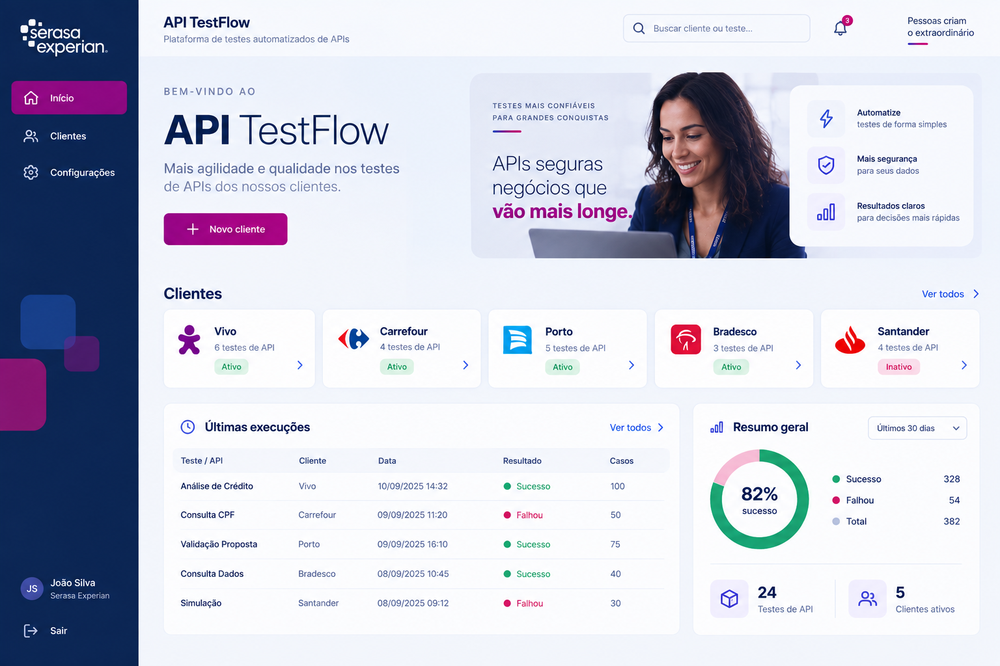
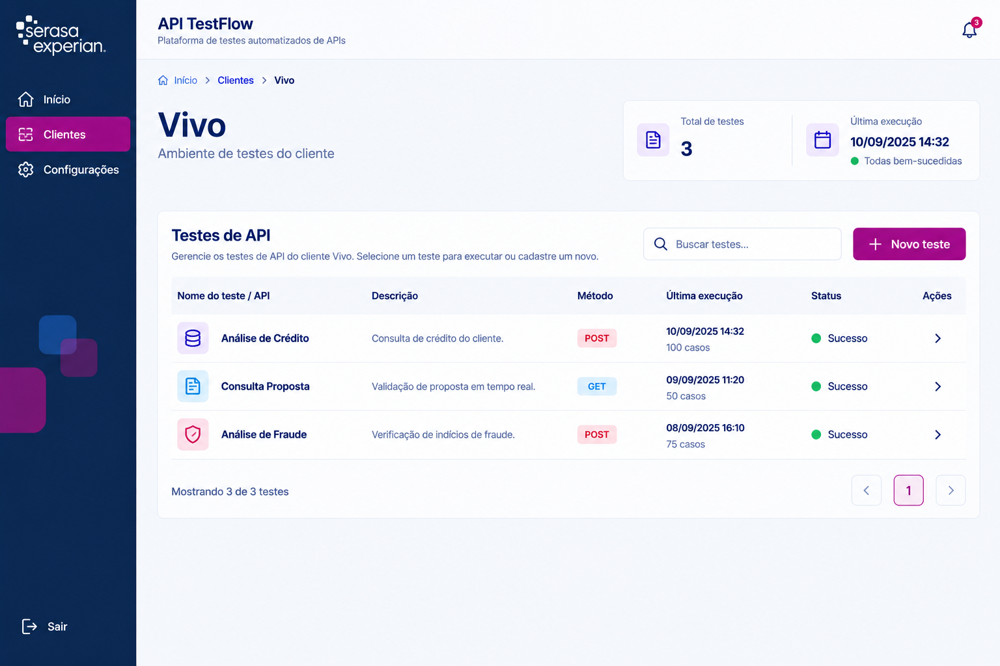
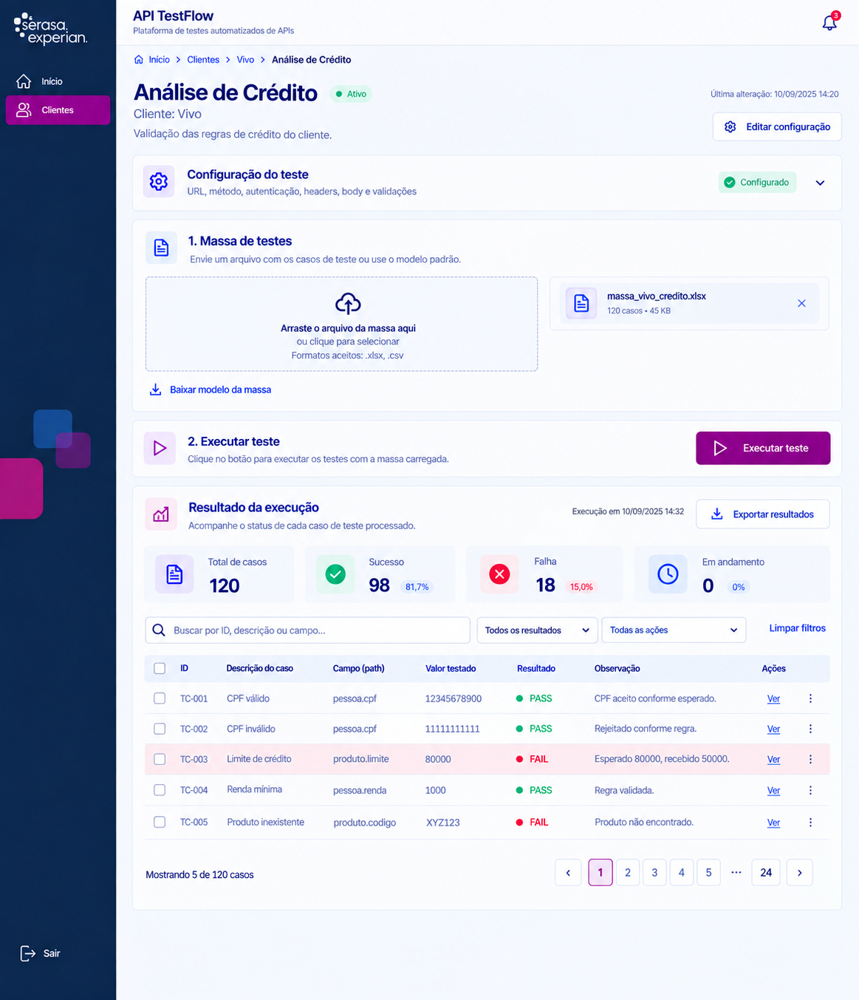

# API TestFlow

Plataforma web para **cadastrar, organizar e executar testes de API** de forma centralizada,
substituindo planilhas soltas e testes manuais dispersos por um fluxo único: **Cliente → Projeto
→ Teste de API**, com massa de dados versionada, regras de validação de negócio configuráveis e
histórico de execuções.

O projeto é dividido em dois módulos independentes que conversam via REST:

| Módulo | Stack | Pasta |
|---|---|---|
| **Backend** | Python 3.12 + FastAPI + SQLAlchemy | [`backend/`](backend) |
| **Frontend** | Angular 19 (standalone components) | [`frontend/`](frontend) |

## Sumário

- [Visão geral do domínio](#visão-geral-do-domínio)
- [Screenshots](#screenshots)
- [Estrutura do repositório](#estrutura-do-repositório)
- [Como rodar o projeto](#como-rodar-o-projeto)
- [Documentação complementar](#documentação-complementar)
- [Roadmap](#roadmap-próximos-passos)

## Visão geral do domínio

```
Cliente ──< Projeto ──< Teste de API ──< Massa de Dados (planilha)
                                    ├──< Regras de Validação (esperado x obtido)
                                    └──< Execuções (histórico PASS/FAIL)
```

- **Cliente**: empresa/área para quem os testes são feitos.
- **Projeto**: agrupamento de testes de um cliente (sempre pertence a um cliente).
- **Teste de API**: a configuração de uma chamada (endpoint, método, headers, params, body,
  autenticação). Sempre pertence a um projeto — não existem testes soltos.
- **Massa de dados**: planilha Excel (modelo oficial em [`modelo_atualizacao_request.xlsx`](modelo_atualizacao_request.xlsx))
  com as variações de dados que serão aplicadas sobre o body base do teste. Cada `caso_id`
  agrupa uma ou mais linhas que formam **um** payload de request.
- **Regras de validação**: o que se espera na *response* de cada caso (campo, operador, valor
  esperado). Uma execução real compara o obtido com o esperado e marca cada caso como `PASS`
  ou `FAIL`.
- **Execução**: uma rodada da massa contra a API real, com o resultado de cada caso e de cada
  regra avaliada, guardado para consulta posterior.

## Screenshots

| Dashboard | Lista de testes | Cadastro de novo teste |
|---|---|---|
|  |  |  |

## Estrutura do repositório

```
ApiTestFlow/
├── backend/                        # API REST (FastAPI)
│   ├── app/
│   │   ├── main.py                 # criação do app, CORS, criação das tabelas
│   │   ├── core/config.py          # DATABASE_URL e CORS_ORIGINS via variáveis de ambiente
│   │   ├── db/                     # engine, sessão e Base declarativa (SQLAlchemy)
│   │   ├── models/                 # Cliente, Projeto, ApiTest, Massa, Execução, RegraValidacao
│   │   ├── schemas/                # contratos Pydantic (request/response)
│   │   ├── repositories/           # acesso a dados (queries)
│   │   ├── services/                # regras de negócio, validações e engine de comparação
│   │   └── routers/                 # endpoints REST
│   ├── tests/                       # pytest + TestClient (SQLite em memória por teste)
│   └── README.md                    # guia específico do backend
├── frontend/                        # SPA (Angular 19, standalone components)
│   ├── src/app/
│   │   ├── core/                    # layout (shell/header/sidebar), services HTTP, config de API
│   │   ├── features/                # telas: home, clientes, projetos, testes, cadastros
│   │   └── shared/                  # models, componentes de UI e forms reutilizáveis
│   └── README.md                    # guia específico do frontend
├── docs/                            # documentação funcional do projeto
│   ├── DocAPItesteFlow.pdf          # especificação funcional detalhada
│   ├── plano_evolucao_framework_testes.docx  # plano de evolução do framework
│   └── screenshots/                 # imagens usadas neste README
└── modelo_atualizacao_request.xlsx  # modelo oficial de massa de dados (usado pelo backend em runtime)
```

> `modelo_atualizacao_request.xlsx` precisa permanecer na raiz do repositório: o backend
> (`backend/app/services/massa_service.py`) lê esse arquivo em tempo de execução para
> disponibilizar o download do modelo e para os testes automatizados de importação de massa.

## Como rodar o projeto

Pré-requisitos: **Python 3.12+**, **Node.js 18+** e **npm**.

### 1. Backend (API)

```bash
cd backend
python -m venv .venv
.venv\Scripts\activate        # Windows (use `source .venv/bin/activate` no Linux/Mac)
pip install -r requirements.txt
uvicorn app.main:app --reload --port 8000
```

- API disponível em `http://localhost:8000`
- Documentação interativa (Swagger) em `http://localhost:8000/docs`
- Banco padrão: SQLite local (`backend/apitestflow.db`, criado automaticamente e ignorado pelo
  git). Para usar Postgres, defina a variável de ambiente `DATABASE_URL` — nenhum código precisa
  mudar.

### 2. Frontend (SPA)

```bash
cd frontend
npm install
npm start
```

- Aplicação disponível em `http://localhost:4200`
- A URL da API é configurada em `frontend/src/app/core/config/api.config.ts`
  (`http://localhost:8000/api` por padrão)

### 3. Testes automatizados

```bash
cd backend
pytest -v
```

## Documentação complementar

- [`docs/DocAPItesteFlow.pdf`](docs/DocAPItesteFlow.pdf) — especificação funcional completa do
  produto.
- [`docs/plano_evolucao_framework_testes.docx`](docs/plano_evolucao_framework_testes.docx) —
  plano de evolução do framework de testes.
- [`backend/README.md`](backend/README.md) — detalhes de arquitetura e endpoints da API.
- [`frontend/README.md`](frontend/README.md) — detalhes de estrutura e telas do frontend.

## Roadmap (próximos passos)

- Execução real de testes via `pytest` orquestrado pelo backend.
- Autenticação/SSO e controle de acesso por cliente/projeto.
- Fila/worker para execuções assíncronas de massas grandes.
- Integração com um secret manager/cofre para tokens de autenticação dos testes (hoje guardados
  em texto simples no ambiente de desenvolvimento — ver nota em `backend/app/models/api_test.py`).

---

Projeto mantido por **Angélica**.
